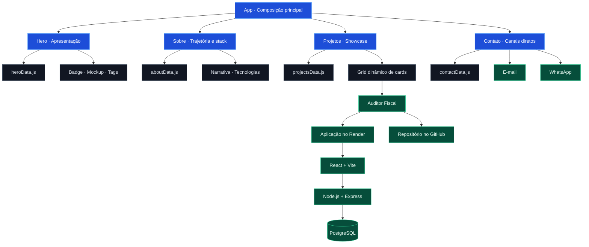

<div align="center">

# Portfólio Dev — Lucas Neves

### Backend em foco. Arquitetura limpa. Software pensado para problemas reais.

[](https://react.dev/)
[](https://vite.dev/)
[](https://tailwindcss.com/)
[](https://developer.mozilla.org/pt-BR/docs/Web/JavaScript)
[](https://developer.mozilla.org/pt-BR/docs/Web/HTML)
[](https://developer.mozilla.org/pt-BR/docs/Web/CSS)
[](https://auditor-ia-txzw.onrender.com)

[Explorar o projeto](#-visão-geral) • [Ver arquitetura](#-arquitetura-e-organização) • [Executar localmente](#-como-executar-localmente) • [Falar comigo](#-conecte-se-comigo)

</div>

---

## 👋 Sobre mim

Sou acadêmico de Sistemas de Informação na Universidade Federal de Lavras (UFLA) e desenvolvedor Full Stack com forte inclinação para Backend. Direciono meus estudos para engenharia de software, Clean Architecture e modelagem de regras de negócio.

Desenvolvi este portfólio para apresentar minha trajetória, minhas competências e os projetos que transformei em software funcional. Busco construir soluções com responsabilidades claras, baixo acoplamento e código que continue compreensível conforme o produto evolui.

> [!IMPORTANT]
> Meu objetivo não é apenas fazer uma interface funcionar. Quero compreender o problema, representar corretamente suas regras e entregar uma base segura para evolução.

## 🧭 Visão geral

Estruturei a aplicação como uma landing page de navegação contínua. Cada seção possui seus próprios dados e componentes, enquanto mantenho na camada global somente os elementos realmente compartilhados.



> [!NOTE]
> O portfólio não envia documentos nem consome diretamente o backend do projeto destacado. Eu uso links externos para conectar o showcase à aplicação publicada e ao respectivo código-fonte.

## ✨ Destaques e funcionalidades

| Área | O que implementei |
|---|---|
| **Identidade** | Criei uma Hero de alto contraste, com meu nome como elemento principal e uma apresentação objetiva do meu foco profissional. |
| **Projetos** | Estruturei um grid orientado a dados, preparado para receber novos cards comuns ou projetos em destaque. |
| **Responsividade** | Adaptei hierarquia, colunas, botões e espaçamentos para celulares, tablets e desktops. |
| **Tema visual** | Construí uma interface Dark Mode com azul elétrico, grid sutil, glow controlado e superfícies de baixo contraste. |
| **Acessibilidade** | Utilizei HTML semântico, foco visível, rótulos acessíveis, navegação por teclado e áreas de toque confortáveis. |
| **Performance** | Mantive a aplicação enxuta, sem bibliotecas visuais desnecessárias, com SVGs inline e build otimizado pelo Vite. |
| **SEO e Core Web Vitals** | Estruturei uma base leve e semântica, preparada para auditorias de SEO e Core Web Vitals; não publico pontuações sem medição reproduzível. |
| **Navegação** | Implementei links internos com rolagem suave para projetos, trajetória e contato. |
| **Integrações** | Conectei cada projeto aos seus endereços reais de demonstração e repositório. |

### Projeto em destaque: Auditor Fiscal

Desenvolvi o **Auditor Fiscal** como um case de portfólio para identificar fragilidades fiscais em documentos empresariais. Modelei validações estruturadas e organizei as responsabilidades da aplicação para manter as regras de negócio desacopladas da interface.

| Recurso | Link |
|---|---|
| 🚀 Aplicação publicada | [Acessar o Auditor Fiscal](https://auditor-ia-txzw.onrender.com) |
| 💻 Código-fonte | [Abrir o repositório](https://github.com/LucasNevesdv/auditor-ia) |

`Node.js` · `Express` · `React` · `Vite` · `PostgreSQL`

## 🧰 Tech stack e ferramentas

| Categoria | Tecnologias | Como utilizei |
|---|---|---|
| **Interface** | React 19, JavaScript | Dividi a experiência em componentes funcionais e seções independentes. |
| **Estilização** | Tailwind CSS 3, CSS3 | Construí o design system, os estados interativos e os breakpoints responsivos. |
| **Build** | Vite 8, PostCSS, Autoprefixer | Configurei desenvolvimento rápido e geração otimizada para produção. |
| **Qualidade** | Oxlint | Automatizei a verificação estática do código-fonte. |
| **Versionamento** | Git, GitHub | Mantenho o histórico do projeto e disponibilizo o código publicamente. |
| **Hospedagem relacionada** | Render | Disponibilizo a demonstração ao vivo do Auditor Fiscal. |
| **CI/CD e entrega** | npm scripts | Ainda não adicionei um pipeline remoto; valido lint e build localmente antes de publicar novas versões. |

## 🏗️ Arquitetura e organização

Organizei o código por **feature**, mantendo juntos os dados, componentes e a composição de cada seção. Evitei transformar `src/components` em um diretório genérico com elementos que nunca seriam reutilizados.

```text
src/
├── App.jsx
├── main.jsx
├── index.css
├── components/
│   └── ui/
│       ├── ActionButton.jsx
│       └── SectionHeading.jsx
└── sections/
    ├── hero/
    │   ├── Hero.jsx
    │   ├── heroData.js
    │   └── components/
    ├── about/
    │   ├── About.jsx
    │   ├── aboutData.js
    │   └── components/
    ├── projects/
    │   ├── Projects.jsx
    │   ├── projectsData.js
    │   ├── projectVisuals.jsx
    │   └── components/
    └── contact/
        ├── Contact.jsx
        ├── contactData.js
        └── components/
```

### Decisões que tomei

- **Dados isolados:** concentrei textos, links, status e metadados nos arquivos `*Data.js`.
- **Componentes locais:** mantive cada componente específico dentro da feature que o utiliza.
- **UI compartilhada:** deixei em `components/ui` apenas elementos usados por mais de uma seção.
- **Projetos escaláveis:** preparei o grid para renderizar `N` projetos a partir de uma coleção de dados.
- **Visuais opcionais:** criei um registro independente para associar mockups especiais aos projetos destacados.
- **Abstração consciente:** não criei `pages`, `services`, `hooks` ou `assets` vazios. Como esta versão é uma landing page sem roteamento ou consumo interno de API, essas camadas adicionariam complexidade sem responsabilidade real.

## 🚀 Como executar localmente

### Pré-requisitos

- Node.js 20 ou superior
- npm
- Git

### Instalação

```bash
git clone https://github.com/LucasNevesdv/portfolio.git
cd portfolio
npm install
npm run dev
```

Depois de iniciar o servidor, acesso o endereço exibido pelo Vite no terminal — normalmente `http://localhost:5173`.

### Qualidade e produção

```bash
npm run lint
npm run build
npm run preview
```

| Comando | Finalidade |
|---|---|
| `npm run dev` | Inicio o ambiente local com atualização instantânea. |
| `npm run lint` | Verifico problemas estáticos no código. |
| `npm run build` | Gero os arquivos otimizados para produção. |
| `npm run preview` | Valido localmente o resultado final do build. |

## 🤝 Conecte-se comigo

Se quiser conversar sobre desenvolvimento, oportunidades ou algum projeto, estes são os canais que utilizo:

<div align="center">

[](https://github.com/LucasNevesdv)
[](mailto:lucasmarcelinoneves@gmail.com)
[](https://wa.me/5535992688086?text=Ol%C3%A1%2C%20Lucas!%20Vi%20seu%20portf%C3%B3lio%20e%20gostaria%20de%20conversar.)

</div>

> [!NOTE]
> Atualmente concentro minha presença profissional no GitHub e não utilizo LinkedIn.

---

<div align="center">

Desenvolvi este projeto com React, Vite e Tailwind CSS.

**© 2026 Lucas Neves**

</div>
